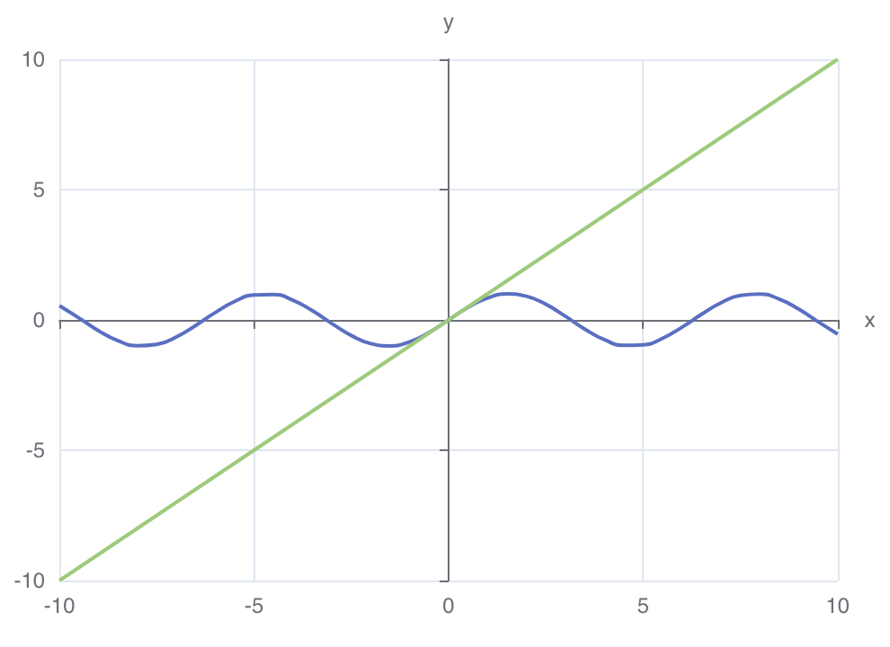
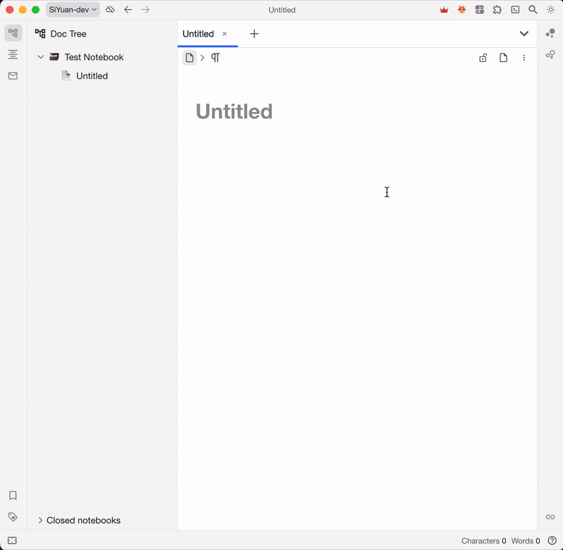
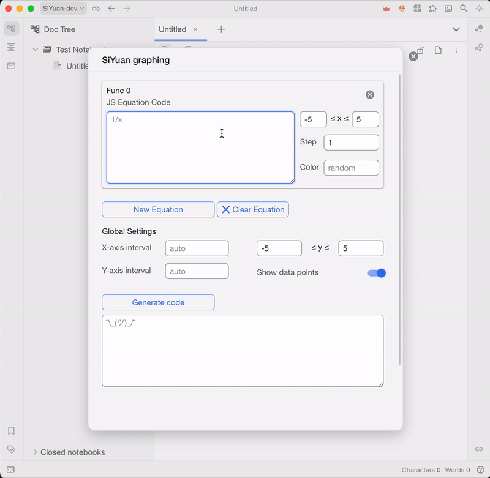
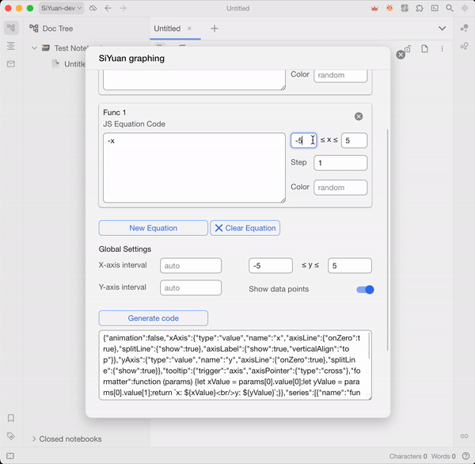
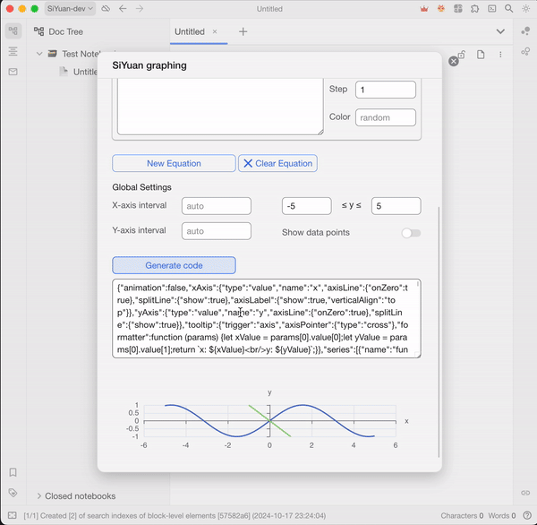
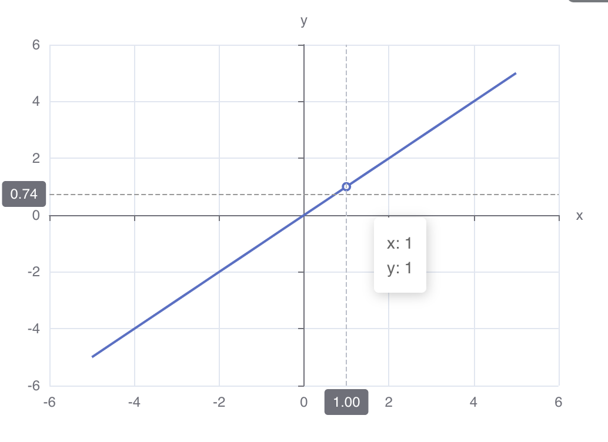
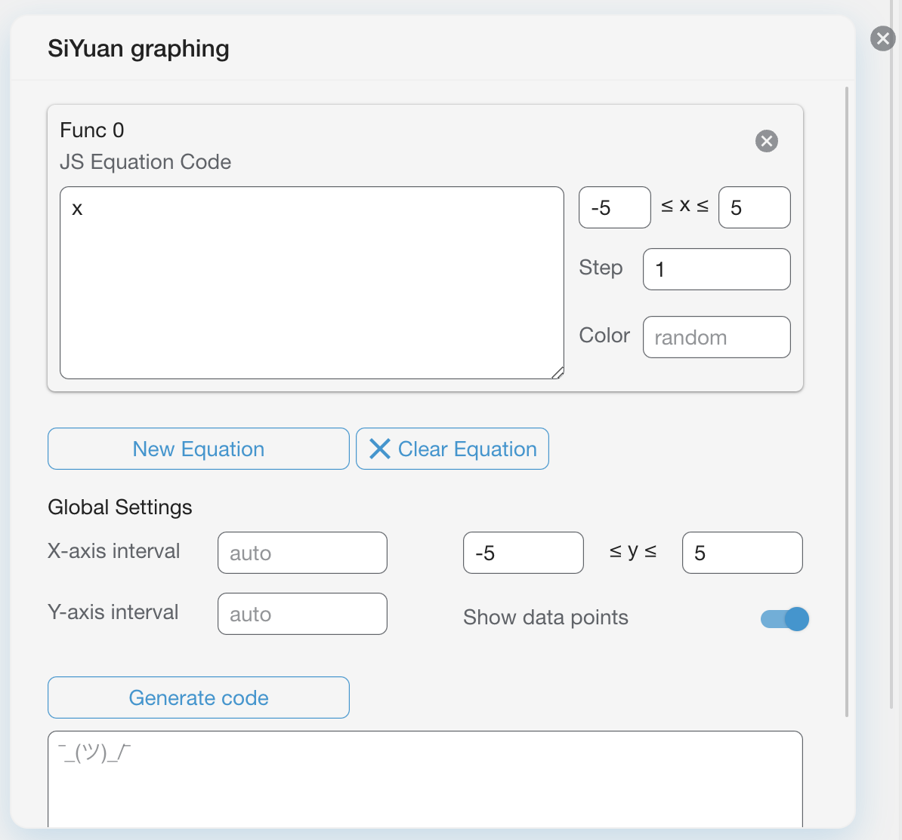
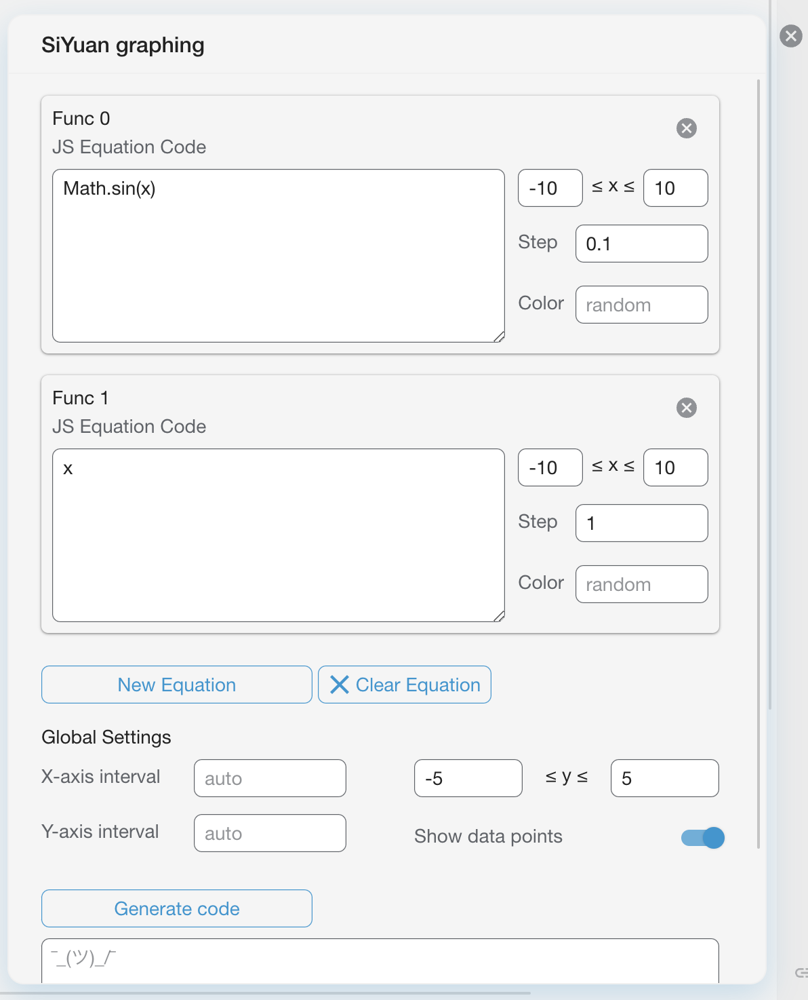
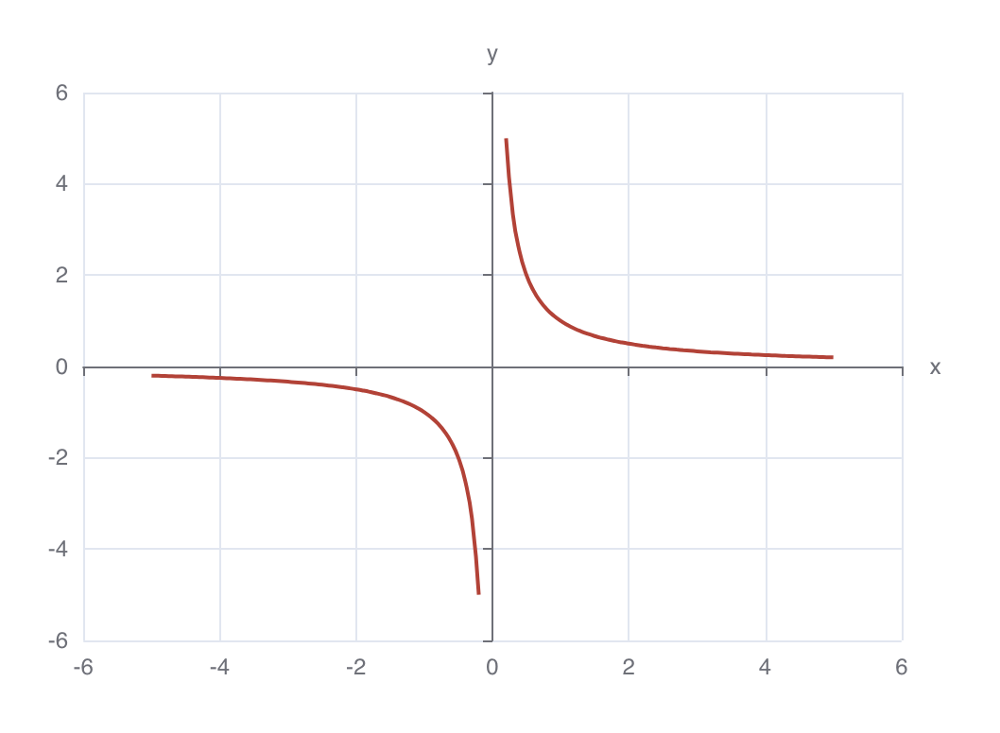
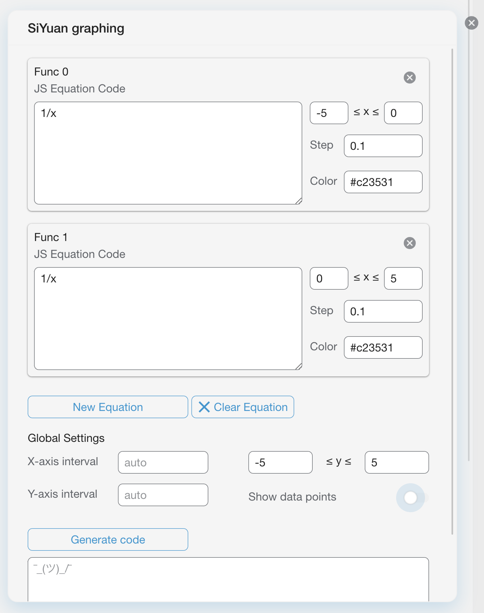

<h1 align="center">SiYuan Graphing</h1>

<a> &emsp;
<a> &emsp;
<a>

<h4 align="center">
<b>English</b> | <a href="README_zh_CN.md">简体中文</a>
</h4>

<h3 align="center">
    
Vanilla Plotting experience with Native SiYuan

</h3>

---

SiYuan Graphing takes advantage of built-in ECharts module to plot math functions, offering seamless integration with
vanilla SiYuan.

### [Features](#features)

- 🍨 No plugin needed for viewing the graph, future proof
- 📈 Support unlimited number of function in a single graph
- 🎨 Fully customizable color, interval, step, and more
- 🔢 Support JavaScript syntax and built-in `Math` functions
- ⏰ Real time preview

### [Roadmap](#roadmap)

- [x] Support for multiple functions
- [x] Real time review
- [ ] Custom JS function
- [ ] Directly adding block to note
- [ ] LaTex support

## [Usage](#usage)

### 1. [Open dialog](#open_dialog)

SiYuan Graphing is currently only accessible from Top Bar icon.

To access SiYuan Graphing

1. find icon  in Top Bar
2. Then click New Graph in dropdown menu to open main interface

                 

### 2. [Compose function](#compose_func)

Enter equation in card on the top.

More equation could be added by clicking *New Equation*

Equations are written in Vanilla JavaScripts, please refer to Google for basic usage.

Domain and step are customizable

SiYuan Graphing will loop from the floor to ceiling of domain by step defined

The equations are implicitly interpreted as `y=equation`

                 

### 3. [Optimize the graph](#optimize_graph)

For complex functions, the default argument might not be optimal

Here are something you should be mindful of

- Rough curve:
    - Cause: Insufficient data point to plot fluent curve
    - Solution: Decrease step to gain more data points
- Continuous when it shouldn't
    - Cause: SiYuan Graph are not smart enough to detect jump, infinite, etc
    - Solution: Plot two functions in same color with domains defined on each side
- Can't see any curve / hard to see on graph
    - Cause: function gorws too big/small that it doesn't fit in the frame
    - Solution: check the graph on graphing calculator and restrict domain and range

                 

### 4. [Insert into note](#insert_note)

To insert into your note
1. click generate code to generate ECharts code
2. Copy the code
3. Go to the position where you want to insert the graph
4. Open slash options with `/`
5. Enter `chart` and select `Chart`
6. Paste the code, done

                 

## [Showcase](#showcase)

#### [Simple Function](#simple_func)
<h3 align="center">
    
    
</h3>

#### [Multiple Functions](#multi_func)
<h3 align="center">
    
    
</h3>

#### [Infinite Functions](#infin_func)
<h3 align="center">
    
    
</h3>