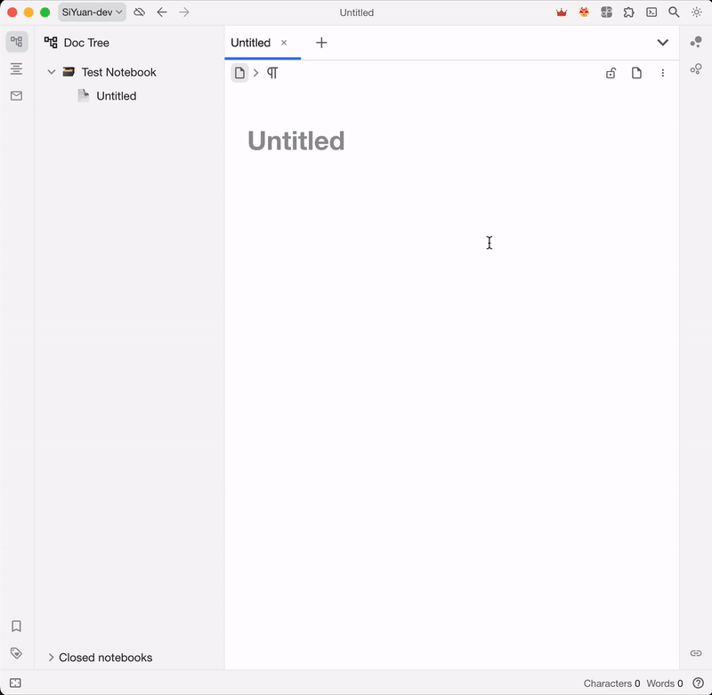
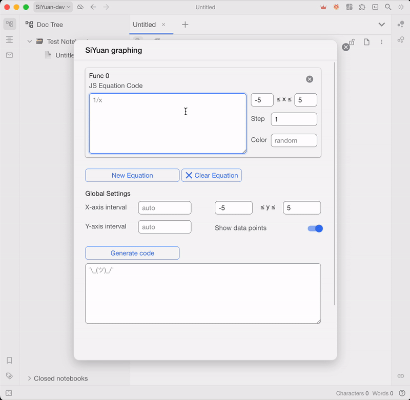
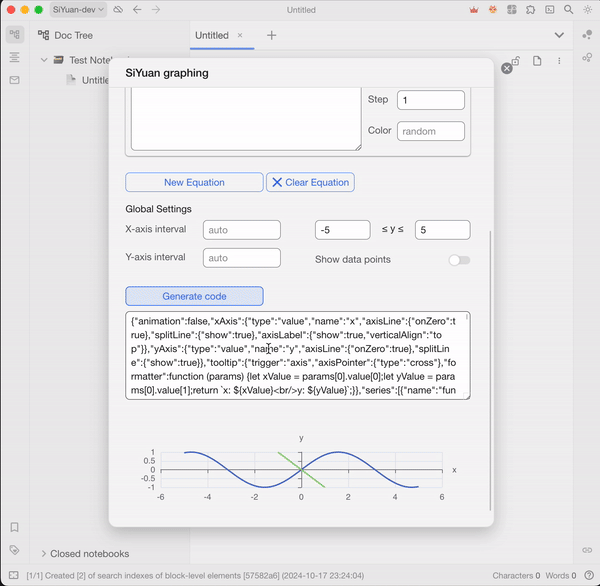
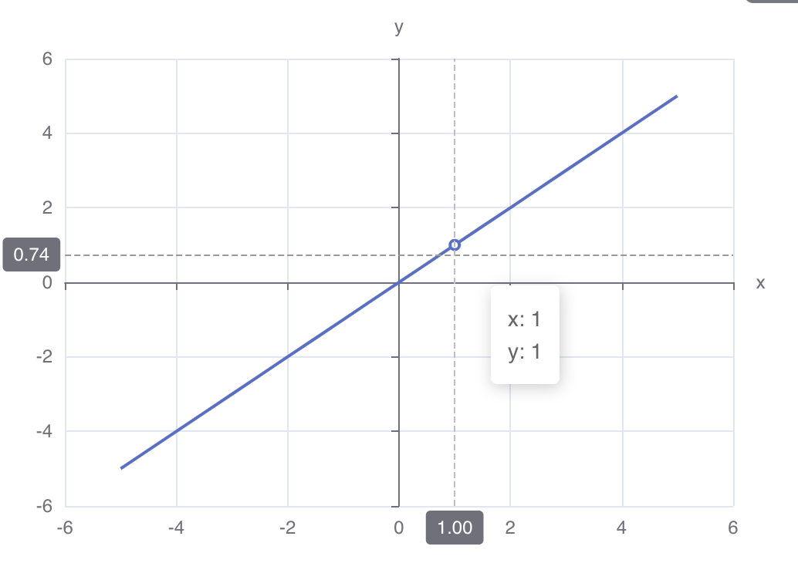
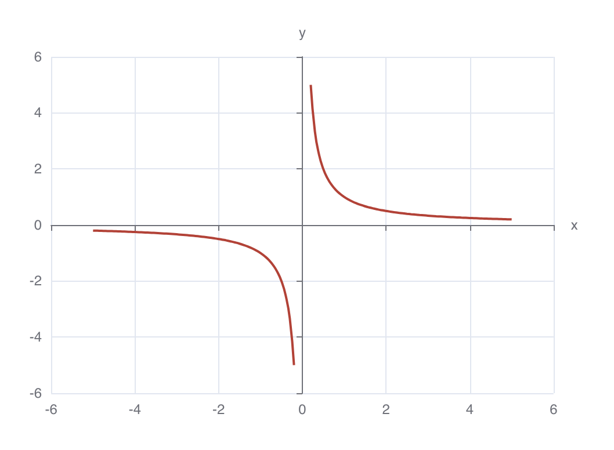

> 現在支持中文（簡體）！

<h1 align="center">SiYuan Graphing</h1>

<a> &emsp;
<a> &emsp;
<a>

<h4 align="center">
<a href="README.md">English</a> | <b>简体中文</b>
</h4>

<h3 align="center">

原生思源的原生绘图体验

</h3>

---

思源绘图利用内置的ECharts模块来绘制数学函数，提供与原生思源的无缝集成。

### [功能](#features)

- 🍨 无需插件即可查看图表，面向未来
- 📈 支持单个图表中无限数量的函数
- 🎨 完全可自定义的颜色、间隔、步进等
- 🔢 支持 JavaScript 语法和内置 `Math` 函数
- ⏰ 实时预览

### [路线图](#roadmap)

- [x] 支持多个函数
- [x] 实时预览
- [ ] 自定义 JS 函数
- [ ] 直接将块添加到笔记
- [ ] LaTex 支持

## [用法](#usage)

### 1. [打开对话框](#open_dialog)

SiYuan Graphing 目前只能从顶部栏图标访问。

要访问 思源绘图

1. 在顶部栏中找到图标 
2. 然后单击下拉菜单中的“新建图表”打开主界面

                

### 2. [编写函数](#compose_func)

在顶部的卡片中输入方程式。

可以通过单击“新函数”添加更多方程式

方程式是用 经典JavaScript 编写的，有关基本用法，请参阅 百度。

定义域和步进可自定义

思源绘图 将按定义的步进从定义域的最小循环到最大

方程式被隐式解释为 `y=equation`

             

### 3. [优化图形](#optimize_graph)

对于复杂函数，默认参数可能不是最佳的

以下是您应该特别注意的事项

- 曲线粗糙：
  - 原因：数据点不足以绘制流畅的曲线
  - 解决方案：减少步进以获得更多数据点
- 不应该连续时连续
  - 原因：思源绘图 不够智能，无法检测跳跃、无限等
  - 解决方案：绘制两个相同颜色的函数，为每侧单独设置定义域
- 看不到任何曲线/图表上很难看到
  - 原因：函数变得太大/太小，无法完全显示
  - 解决方案：通过图形计算器检查图形并限制定义域和值域

           

### 4. [插入注释](#insert_note)

要插入到您的笔记中
1. 单击生成代码以生成 ECharts 代码
2. 复制代码
3. 转到要插入图表的位置
4. 使用 `/` 打开斜线选项
5. 输入 `chart` 并选择 `Chart`
6. 粘贴代码，完成

             

## [展示](#showcase)

#### [简单函数](#simple_func)
<h3 align="center">

</h3>

#### [多个函数](#multi_func)
<h3 align="center">

</h3>

#### [无限函数](#infin_func)
<h3 align="center">

</h3>
